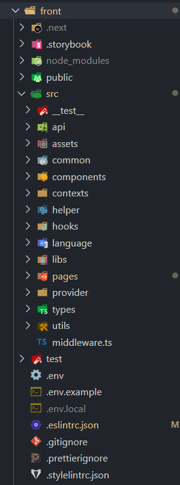
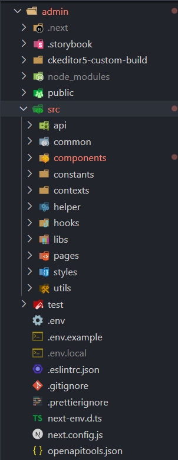
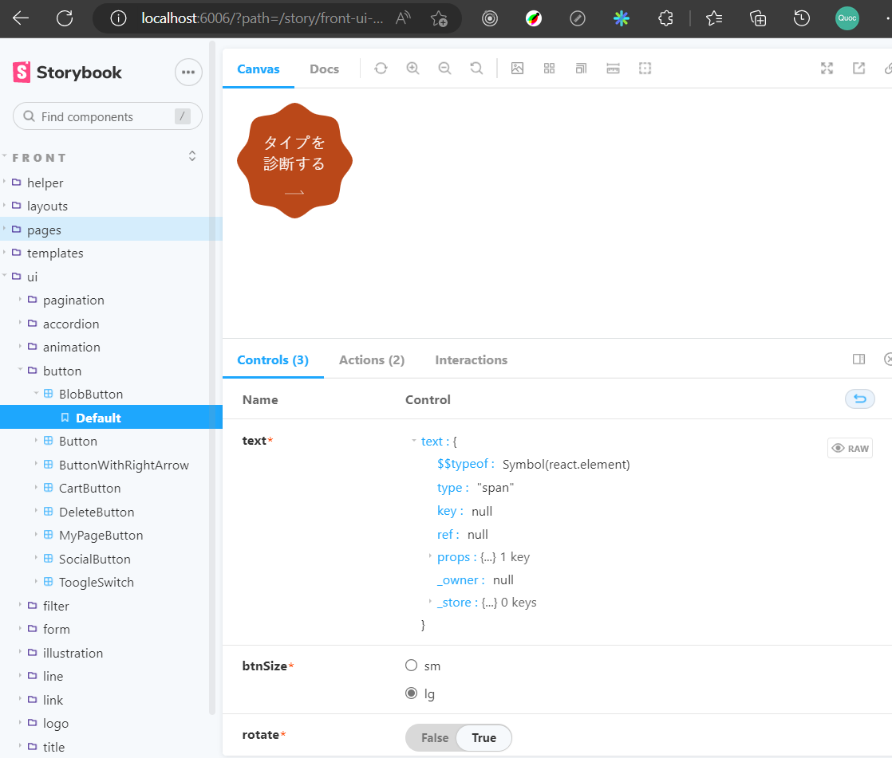
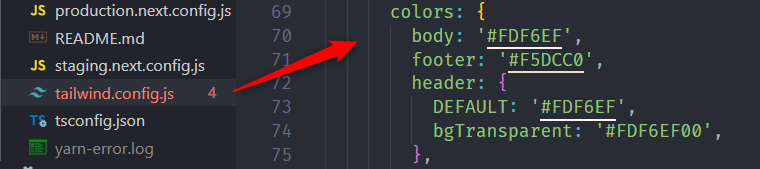

# Front-End Documents

## Framework

Front-end hiện tại đang sử dụng NextJS (Framework của ReactJS).

## Cài đặt môi trường

### Setup Docker

```
APP_NAME=worldcoffee docker-compose up --build
```

### Setup cho API

> Thực thi docker và setup database

```
docker exec -it worldcoffee_php sh
composer install
cp .env.example .env
php artisan key:generate
php artisan migrate
php artisan db:seed
php artisan passport:install
```

### Web End-user

> Cấu trúc source



> Setup cho web End-user

```
cd front
cp .env.example .env.local
npm ci
npm run dev
```

> Tài khoản test http://localhost:3001

```
email: test@example.com
password:testtest
```

### Web Admin

> Cấu trúc source



> Setup cho web Admin

```
docker exec -it worldcoffee_admin sh
npm install
cp .env.example .env.local
npm run dev
```

> Tài khoản test http://localhost:3002

```bash
login_id: admin
password: admin123
```

## Storybook cho web End-user

[Storybook](https://storybook.js.org) là một công cụ giúp phát triển các UI component dưới một môi trường tách biệt hoàn toàn với ứng dụng web chính. Chức năng chủ chốt của Storybook đó là sinh ra một trang tài liệu (documentation) cho toàn bộ các UI Component có trong dự án. Ngoài ra, hỗ trợ nhiều giải pháp cho automation UI testing.

> Run Storybook ở local (port mặc định 6006)

```
cd front
npm run storybook or yarn storybook
```

Giao diện sau khi run thành công http://localhost:6006/



## CSS

Sử dụng [Tailwind CSS](https://tailwindcss.com 'Tailwind CSS') để build styles cho front-end.

Một số quy tắc:

- Ở các màn hình quản lý sử dụng các đơn vị có sẵn của Tailwind như `md`, `lg`, `2xl`.
- Khi xài `padding`, `margin` thì khuyến khích sử dụng đơn vị `em` hoặc `rem`, không nên sử dung đơn vị `px` quá nhiều.
- Font chữ phải được định nghĩa trong file `tailwind.config.js`
  

- Màu sắc cũng được định nghĩa trong file `tailwind.config.js`
  

## Typescript

- Cấu hình `tsconfig.json` được extend từ [FrontConf/tsconfig.json](https://github.com/80andCo/FrontConf/blob/main/tsconfig.json 'FrontConf')
- Cấu hình ESLint được extend từ [FrontConf/src/config/config.json](https://github.com/80andCo/FrontConf/blob/main/src/config/config.json 'FrontConf')
- Sử dụng mảng thì nên khai báo dưới dạng `string[]`, `number[]`. Khai báo dạng `Array<string>` thì không được khuyến khích, chỉ sử dụng khi cần thiết.

## Định dạng code và kiểm tra lỗi

- [ESLint](https://eslint.org): Kiểm tra lỗi và cú pháp trong ECMAScript/JavaScript. Extension cho `VS Code` =>
  [ESLint extension](https://marketplace.visualstudio.com/items?itemName=dbaeumer.vscode-eslint 'ESLint')
- [Prettier](https://prettier.io): Format code theo cấu hình. Extension cho `VS Code` => [Prettier extension](https://marketplace.visualstudio.com/items?itemName=esbenp.prettier-vscode 'Prettier')
- [Stylelint](https://stylelint.io): Kiểm tra lỗi trong CSS. Extension cho `VS Code` => [Stylelint extension](https://marketplace.visualstudio.com/items?itemName=stylelint.vscode-stylelint 'Stylelint')

## Nguyên tắc commit code (message)

### Nội dung message

Required (bắt buộc):

- fix: `<chỉnh sữa lỗi,...>`
- add: `<bổ sung chức năng, thêm file mới>`
- update: `<cập nhật code, tính năng (không phải lỗi)>`
- remove: `<xóa bỏ file, function,...>`

Optional (tùy chọn):

- hotfix: `<sửa các lỗi quan trọng>`
- change: `<thay đổi đặc tả>`
- clean: `<sắp xếp (tái cấu trúc)>`
- disable: `<vô hiệu hóa (bình luận,..)>`
- upgrade: `<nâng cấp version, package>`
- revert: `<khôi phục lại code, chức năng trước đó>`
- style: `<cập nhật style, css>`

Có thể đưa `#{số issue}` vào trong message để tiện theo dõi issue của mình trên github. Link tham khảo [Issue-driven development](https://gist.github.com/Enchan1207/0ea2c7a7d6a3c16aea5683435d1972f8)

Tham khảo khác:

- [100 câu ví dụ về commit message trong git](https://gist.github.com/Enchan1207/0ea2c7a7d6a3c16aea5683435d1972f8)
- Blog [【今日からできる】コミットメッセージに 「プレフィックス」 をつけるだけで、開発効率が上がった話](https://qiita.com/numanomanu/items/45dd285b286a1f7280ed)
- Blog [Cách viết commit message hiệu quả](https://qiita.com/itosho/items/9565c6ad2ffc24c09364)
- Blog [いいコミットメッセージの共通点と書き方〜便利なテンプレートやチーム開発時のお作法まで詳しく解説〜](https://www.praha-inc.com/lab/posts/commit-message)
