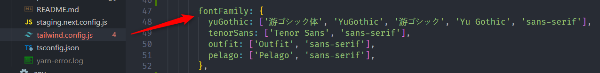

# Front-End Documents

## Framework

Front-end hiện tại đang sử dụng NextJS (Framework của ReactJS).

## Cài đặt môi trường

### Setup Docker

```
APP_NAME=worldcoffee docker-compose up --build
```

### Setup cho API

> Thực thi docker và setup database

```
docker exec -it worldcoffee_php sh
composer install
cp .env.example .env
php artisan key:generate
php artisan migrate
php artisan db:seed
php artisan passport:install
```

### Web End-user

> Cấu trúc source


> Setup cho web End-user

```
cd front
cp .env.example .env.local
npm ci
npm run dev
```

> Tài khoản test http://localhost:3001

```
email: test@example.com
password:testtest
```

### Web Admin

> Cấu trúc source


> Setup cho web Admin

```
docker exec -it worldcoffee_admin sh
npm install
cp .env.example .env.local
npm run dev
```

> Tài khoản test http://localhost:3002

```bash
login_id: admin
password: admin123
```

## Định dạng code và kiểm tra lỗi

- [ESLint](https://marketplace.visualstudio.com/items?itemName=dbaeumer.vscode-eslint 'ESLint'): Kiểm tra lỗi và cú pháp cho code.
- [Prettier](https://marketplace.visualstudio.com/items?itemName=esbenp.prettier-vscode 'Prettier'): Format code theo cấu hình.

## CSS

Sử dụng [Tailwind CSS](https://tailwindcss.com 'Tailwind CSS') để build styles cho front-end.

Một số quy tắc:

- Ở các màn hình quản lý sử dụng các đơn vị có sẵn của Tailwind như `md`, `lg`, `2xl`.
- Khi xài `padding`, `margin` thì khuyến khích sử dụng đơn vị `em` hoặc `rem`, không nên sử dung đơn vị `px` quá nhiều.
- Font chữ phải được định nghĩa trong file `tailwind.config.js`
  

- Màu sắc cũng được định nghĩa trong file `tailwind.config.js`
  

## Typescript

- Cấu hình `tsconfig.json` được extend từ [FrontConf/tsconfig.json](https://github.com/80andCo/FrontConf/blob/main/tsconfig.json 'FrontConf')
- Cấu hình ESLint được extend từ [FrontConf/src/config/config.json](https://github.com/80andCo/FrontConf/blob/main/src/config/config.json 'FrontConf')
- Sử dụng mảng thì nên khai báo dưới dạng `string[]`, `number[]`. Khai báo dạng `Array<string>` thì không được khuyến khích, chỉ sử dụng khi cần thiết.
